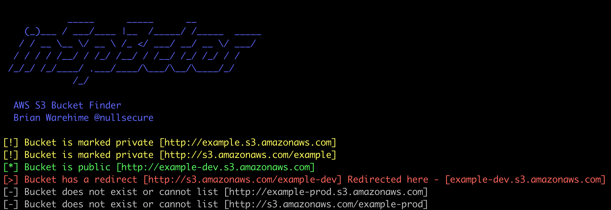

# inSp3ctor
AWS S3 Bucket/Object Finder

```
            _____      _____      __
    (_)___ / ___/____ |__  /_____/ /_____  _____
   / / __ \__ \/ __ \ /_ </ ___/ __/ __ \/ ___/
  / / / / /__/ / /_/ /__/ / /__/ /_/ /_/ / /
 /_/_/ /_/____/ .___/____/\___/\__/\____/_/
             /_/

  AWS S3 Bucket Finder
  Brian Warehime @nullsecure

usage: inSp3ctor.py [-h] [-w wordlist] [-n root] [-o] [-c] [-a] [-p] [-b batch] [-j] [-t] [-v]

AWS s3 Bucket Permutation Checker

optional arguments:
  -h, --help   show this help message and exit
  -w wordlist  Specify list of buckets to check from wordlist
  -n root      Specify the root name to use, i.e. google, amazon
  -o           Check objects in a public s3 bucket if they are available
  -c           Write results to csv
  -a           Use AWS Credentials to authenticate the request
  -p           Only show buckets/objects that are public in the results
  -b batch     Specify filename containing words to apply permutations to
  -j           JSON output
  -t           Do not print banner
  -v           Verbose
```

## How To Use

You can either use a pre-made wordlist containing all the buckets/objects you want to check or supply a root name, and let inSp3ctor add in common permutations to the bucket name to find different variations. 

More speed? Check the [thread_verison!](threads_version/)

### Example

If you wanted to look for any information for `example`, you'd run `python inSp3ctor.py -n example`, you can supply the argument `-o` if you want to check the status of the objects contained in the public buckets.



If you want to do lookups on a batch of companies, you can specify `-b` and supply a wordlist file, with a name on each line. The tool will then run through each line and lookup each name along with the list of permutations consecutively. I would recommend specifying `-p` to only output the public buckets/objects.

Json output example

`python3 inSp3ctor.py -j -t -o -n example | jq`

```json
{
  "Bucket": {
    "private": [
      "http://example.s3.amazonaws.com",
      "http://s3.amazonaws.com/example",
      "http://example-production.s3.amazonaws.com"
    ],
    "public": [
      "http://example-dev.s3.amazonaws.com"
    ],
    "redirect": [
      "http://s3.amazonaws.com/example-dev -> http://example-dev.s3.amazonaws.com",
      "http://s3.amazonaws.com/example-production -> http://example-production.s3.amazonaws.com"
    ],
    "no_exist": [
      "http://example-prod.s3.amazonaws.com",
      "http://s3.amazonaws.com/example-prod"
    ]
  },
  "Object": {}
}
```

## TODO
- Right now, the AWS credentials are hardcoded in the python script, which should be handled through the `/.aws` credential file.
